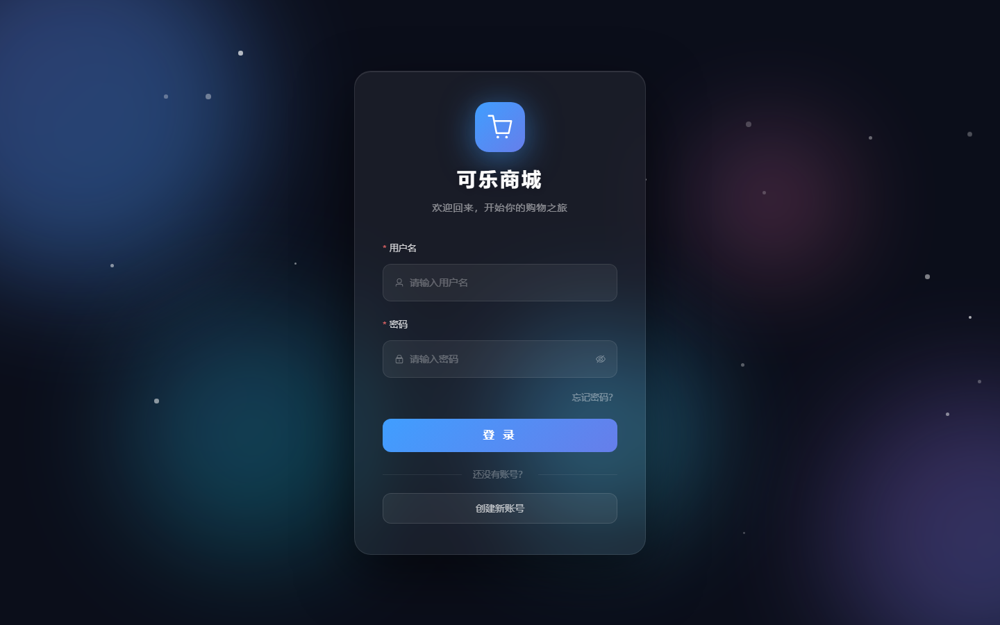
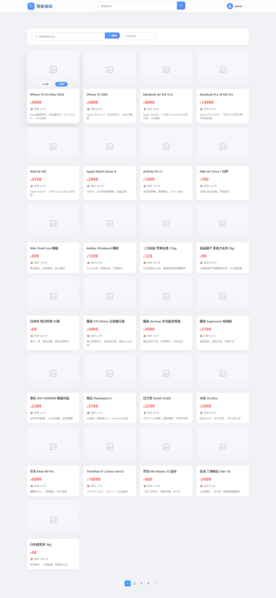
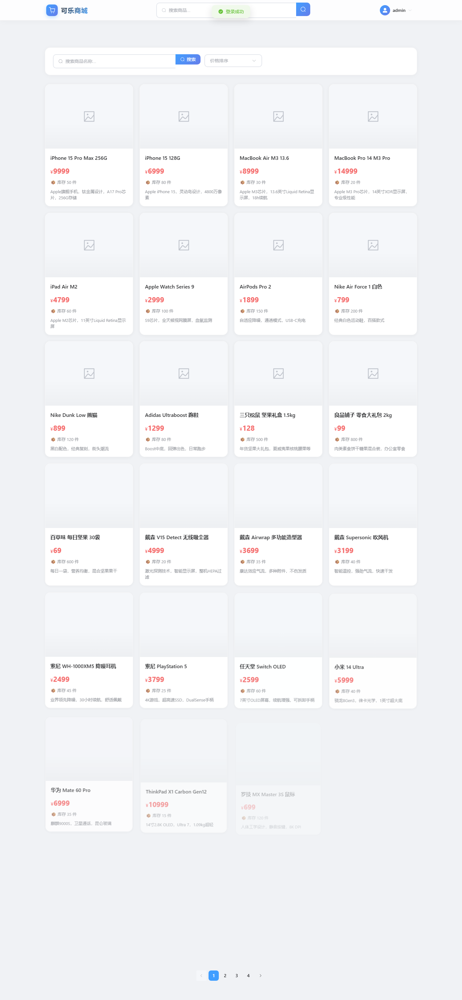
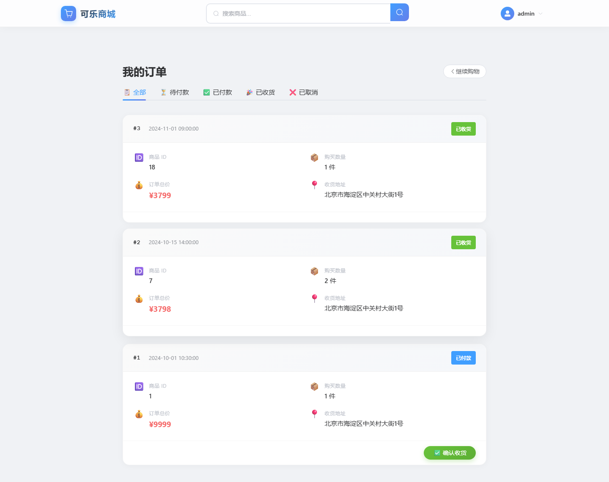

<div align="center">
  <h1>🥤 可乐商城 · 全栈电商系统</h1>
  <p>Spring Boot 3 + Vue 3 电商全栈项目｜实习练手作品</p>
  <p>
    <a href="https://github.com/wcm609/business">
      
    </a>
    <a href="https://github.com/wcm609/business">
      
    </a>
    <a href="https://github.com/wcm609/business">
      
    </a>
    <a href="https://github.com/wcm609/business">
      
    </a>
  </p>
</div>

---

## 📋 项目介绍

一个简单的电商全栈项目，实现了**用户登录注册、商品浏览、下单购买、订单管理**等核心电商流程。

### 功能预览

| 页面 | 功能 |
|------|------|
| 登录 / 注册 | 表单验证、密码加密传输、JWT 登录态维持 |
| 商品列表 | 卡片网格展示、搜索、价格排序、分页 |
| 商品详情 | 商品信息、数量选择、下单 |
| 我的订单 | 按状态筛选、付款 / 确认收货 / 取消 |
| 个人中心 | 订单统计、个人信息展示 |

---

## 🏗️ 项目结构

```
business/
├── backend/                        # Spring Boot 后端
│   ├── src/main/java/com/ecommerce/
│   │   ├── config/                 # 配置（JWT拦截器、全局异常、WebMVC、BCrypt）
│   │   ├── constant/               # 常量（订单状态）
│   │   ├── controller/             # 控制器（User、Product、Order）
│   │   ├── dto/                    # 数据传输对象
│   │   ├── entity/                 # 实体类
│   │   ├── exception/              # 自定义异常
│   │   ├── mapper/                 # MyBatis 数据访问
│   │   ├── service/                # 业务逻辑
│   │   ├── util/                   # JWT 工具
│   │   └── vo/                     # 视图对象
│   └── src/main/resources/
│       └── application.yml         # 数据库配置
│
├── frontend/                       # Vue 3 前端
│   ├── src/
│   │   ├── api/                    # Axios 接口封装
│   │   ├── components/             # 公共组件
│   │   ├── router/                 # 路由配置 + 守卫
│   │   ├── views/                  # 页面（6 个）
│   │   └── utils/                  # 工具函数
│   └── vite.config.js              # 开发代理配置
│
└── init-data.sql                   # 测试数据（30用户 + 25商品 + 50订单）
```

---

## 🚀 技术栈

### 后端

| 技术 | 用途 |
|------|------|
| Spring Boot 3.5 | 基础框架 |
| MyBatis 3.0 | ORM 数据访问 |
| MySQL 8 | 数据库 |
| JWT (jjwt) | Token 鉴权 |
| BCrypt | 密码加密 |
| Maven | 构建工具 |

### 前端

| 技术 | 用途 |
|------|------|
| Vue 3 (Composition API) | 前端框架 |
| Vue Router 4 | 路由 + 导航守卫 |
| Element Plus 2 | UI 组件库 |
| Axios | HTTP 请求 |
| Vite | 构建工具 |

---

## ⚡ 快速启动

### 前置条件

- JDK 17+
- Node.js ≥ 22
- MySQL 8
- Maven

### 1. 创建数据库

```sql
CREATE DATABASE business CHARACTER SET utf8mb4 COLLATE utf8mb4_unicode_ci;
```

### 2. 导入测试数据

```bash
mysql -u root -p business < init-data.sql
```

### 3. 启动后端

```bash
cd backend
mvn spring-boot:run
```

后端运行在 `http://localhost:8080`

### 4. 启动前端

```bash
cd frontend
npm install
npm run dev
```

前端运行在 `http://localhost:5173`

> 前端开发服务器已配置代理，`/api` 请求自动转发到后端 8080 端口。

---

## 📮 API 接口一览

### 用户模块（无需登录）

| 方法 | 路径 | 说明 |
|------|------|------|
| POST | `/user/register` | 注册（JSON body） |
| POST | `/user/login` | 登录（表单参数） |
| GET | `/user/info?userId=` | 用户信息 |

### 商品模块（无需登录）

| 方法 | 路径 | 说明 |
|------|------|------|
| GET | `/product/list` | 商品列表 |
| GET | `/product/detail?productName=` | 按名称查询 |
| POST | `/product/add` | 新增商品 |

### 订单模块（需要 Bearer Token）

| 方法 | 路径 | 说明 |
|------|------|------|
| POST | `/order/create` | 下单 |
| GET | `/order/list?userId=` | 我的订单（含商品信息） |
| PUT | `/order/pay?orderId=` | 付款 |
| PUT | `/order/confirm?orderId=` | 确认收货 |
| PUT | `/order/cancel?orderId=` | 取消订单 |

---

## 🔐 测试账号

| 用户名 | 密码 | 说明 |
|--------|------|------|
| admin | 123456 | 管理员，有 3 条订单 |
| zhangsan | 123456 | 普通用户，有 6 条订单 |
| lisi | 123456 | 普通用户，有 5 条订单 |
| manager | admin123 | 管理员 |

---

## 🧩 订单状态说明

| 状态值 | 含义 |
|--------|------|
| 0 | 待付款 |
| 1 | 已付款 |
| 3 | 已收货 |
| 4 | 已取消 |

---

## 📸 页面截图

| 登录页 | 商品详情 |
|:------:|:--------:|
|  |  |

| 商品列表 | 我的订单 |
|:--------:|:--------:|
|  |  |

---

## ✨ 项目亮点（简历向）

- ✅ **全栈闭环**：从数据库设计 → 后端 API → 前端页面，完整的电商链路
- ✅ **安全规范**：BCrypt 密码加密 + JWT 鉴权拦截 + 全局异常处理
- ✅ **代码整洁**：统一 `Result<T>` 响应格式，RESTful 接口命名，Service 层隔离
- ✅ **多表查询**：订单列表 left join 商品表，避免 N+1 问题
- ✅ **前端工程化**：Axios 拦截器自动注入 Token，路由守卫鉴权，统一错误处理
- ✅ **状态管理**：订单状态机（待付款 → 已付款 → 已收货 / 可取消）